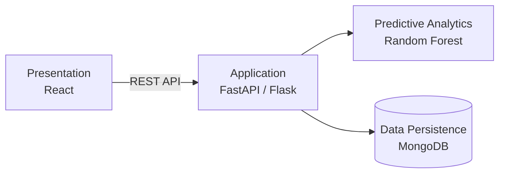

<h1 align="center">Juliet Samson Raj S</h1>

<b>Aspiring AI Engineer</b> · M.Sc. Artificial Intelligence

  <a href="https://julietsamsonraj2005.github.io/">Portfolio</a> ·
  <a href="https://www.linkedin.com/in/juliet-samson-raj-s-12a8b2315/">LinkedIn</a> ·
  <a href="mailto:julietsamsonraj2005@gmail.com">Email</a>

---

## Summary

M.Sc. Artificial Intelligence student with hands-on experience in Python, Scikit-learn, REST APIs and React. I build machine learning products end to end: training the model, exposing it through an API and delivering it in a usable interface.

## Education

| Program | Institution | Years |
|---|---|---|
| M.Sc. Artificial Intelligence | St. Joseph's College (Autonomous), Tiruchirappalli | 2026 – 2028 |
| B.Sc. Computer Science | Malankara Catholic College, Mariagiri | 2023 – 2026 |

## Experience

**MERN Stack Development Intern** · Srishti Innovative Educational Services, Trivandrum
Two-week internship building web applications with the MERN stack.

## Technical Skills

| Area | Technologies |
|---|---|
| Languages | Python, C++, JavaScript, PHP |
| Machine Learning | Scikit-learn, TensorFlow, PyTorch |
| Backend | FastAPI, Flask, REST APIs |
| Frontend | React, HTML, CSS, Bootstrap |
| Databases | MySQL, MongoDB |
| Tools | Git, GitHub |

## Selected Projects

### [HealthAI](https://github.com/julietsamsonraj2005/healthai): AI-Based Health Risk Prediction System

Predicts health risk from user-entered health parameters using a Random Forest model.

- Four-layer architecture: Presentation, Application, Predictive Analytics and Data Persistence
- Secure REST APIs connect the React frontend, the ML model and MongoDB

**Stack:** React · FastAPI / Flask · Scikit-learn · MongoDB

### [FitMentor](https://github.com/julietsamsonraj2005/fit-mentor): Fitness Management Web Application

Full-stack platform for tracking workouts and following personalized plans.

- Workout tracking, BMI calculation, and personalized workout and diet plans
- Secure authentication, profile management, progress tracking and an admin dashboard

**Stack:** HTML · CSS · JavaScript · Bootstrap · PHP · MySQL

### [Doc_Genie](https://github.com/julietsamsonraj2005/Doc_Genie): Python Docstring Generator

Developer tool that documents Python code automatically.

- Analyzes functions, including loops and conditionals, with Python's `ast` module
- Generates Google-style or NumPy-style docstrings
- Gradio web interface with PDF report export

**Stack:** Python · ast · Gradio · ReportLab

## Contact

- Email: [julietsamsonraj2005@gmail.com](mailto:julietsamsonraj2005@gmail.com)
- LinkedIn: [juliet-samson-raj-s](https://www.linkedin.com/in/juliet-samson-raj-s-12a8b2315/)
- Portfolio: [julietsamsonraj2005.github.io](https://julietsamsonraj2005.github.io/)
