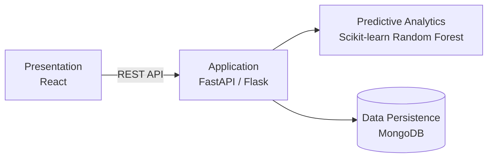

  

  
  
  

---

## About

I turn trained models into complete applications: the predictions, the REST API behind them and the interface people use. My work covers the full path from data and model training to backend services and web front ends.

<table>
  <tr>
    <td width="50%" valign="top">
      <b>Education</b> 
      M.Sc. Artificial Intelligence (2026–2028) 
      St. Joseph's College (Autonomous), Tiruchirappalli  
      B.Sc. Computer Science (2023–2026) 
      Malankara Catholic College, Mariagiri
    </td>
    <td width="50%" valign="top">
      <b>Experience</b> 
      MERN Stack Development Intern 
      Srishti Innovative Educational Services, Trivandrum (2 weeks)  
      <b>Focus</b> 
      Machine learning applications, REST APIs, full-stack development
    </td>
  </tr>
</table>

---

## Tech Stack

<table>
  <tr>
    <td><b>Languages</b></td>
    <td></td>
  </tr>
  <tr>
    <td><b>Machine Learning</b></td>
    <td>
      
      
    </td>
  </tr>
  <tr>
    <td><b>Backend</b></td>
    <td></td>
  </tr>
  <tr>
    <td><b>Frontend</b></td>
    <td></td>
  </tr>
  <tr>
    <td><b>Databases</b></td>
    <td></td>
  </tr>
  <tr>
    <td><b>Tools</b></td>
    <td></td>
  </tr>
</table>

---

## Featured Projects

<table>
  <tr>
    <td width="50%" valign="top">
      
       <b>HealthAI: AI-Based Health Risk Prediction</b>
      <ul>
        <li>Random Forest model trained on health parameters to predict risk</li>
        <li>Four-layer architecture with secure REST APIs</li>
      </ul>
      <code>React</code> <code>FastAPI / Flask</code> <code>Scikit-learn</code> <code>MongoDB</code>
    </td>
    <td width="50%" valign="top">
      
       <b>FitMentor: Fitness Management Platform</b>
      <ul>
        <li>Workout tracking, BMI calculation, personalized workout and diet plans</li>
        <li>Secure authentication, progress tracking, admin dashboard</li>
      </ul>
      <code>HTML</code> <code>CSS</code> <code>JavaScript</code> <code>Bootstrap</code> <code>PHP</code> <code>MySQL</code>
    </td>
  </tr>
  <tr>
    <td width="50%" valign="top">
      
       <b>Doc_Genie: Python Docstring Generator</b>
      <ul>
        <li>Analyzes functions, loops and conditionals, then writes Google-style or NumPy-style docstrings</li>
        <li>Gradio web interface with PDF report export</li>
      </ul>
      <code>Python</code> <code>ast</code> <code>Gradio</code> <code>ReportLab</code>
    </td>
    <td width="50%" valign="top"></td>
  </tr>
</table>

### HealthAI architecture

---

## GitHub Activity

  
  

---

## Contact

  <a href="mailto:julietsamsonraj2005@gmail.com">julietsamsonraj2005@gmail.com</a> &nbsp;|&nbsp;
  <a href="https://julietsamsonraj2005.github.io/">julietsamsonraj2005.github.io</a>

